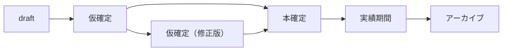

# Phase 3 実装サマリー

## 📋 実装完了項目

### 1. 認証API（既存確認＋フロントエンド統合）

#### バックエンド（既存実装）
- ✅ `POST /api/simple-auth/login` - 職員ログイン（employeeId/email）
- ✅ `POST /api/simple-auth/logout` - 職員ログアウト
- ✅ `GET /api/simple-auth/me` - 職員情報取得
- ✅ `POST /api/admin-auth/login` - 管理者ログイン（email）
- ✅ `POST /api/admin-auth/logout` - 管理者ログアウト
- ✅ `GET /api/admin-auth/me` - 管理者情報取得

#### フロントエンド（新規実装）
- ✅ `client/src/services/authService.ts` - 本番実装完了
  - `loginAsEmployee()` - 職員ログイン
  - `loginAsAdmin()` - 管理者ログイン
  - `logout()` - ログアウト（両方のCookieをクリア）
  - `getCurrentUser()` - 現在のユーザー取得（職員/管理者両対応）

### 2. 希望休API拡張

#### バックエンド（拡張完了）
- ✅ `server/routers.ts` - leaveRequests ルーター拡張
  - `create`: `leaveType`, `startTime`, `endTime`, `isAdditional` 対応
  - `update`: 全フィールド更新対応
  - `delete`: 削除API追加
- ✅ `server/db.ts` - deleteLeaveRequest() 関数追加

#### 新フィールド
```typescript
leaveType: "休" | "有休" | "時間指定"
startTime: string // HH:MM format
endTime: string // HH:MM format
isAdditional: boolean // 追加希望休（仮確定後）
```

### 3. シフトAPI拡張

#### 6段階ステータスフロー
```
draft → tentative → tentative_revised → confirmed → actual → archived
```

#### バックエンド（拡張完了）
- ✅ `server/routers.ts` - shifts ルーター拡張
  - `create`: `leaveRequestDeadline`, `additionalRequestDeadline` 対応
  - `publishTentative`: 仮確定公開API追加
  - `confirm`: 本確定API追加
  - `archive`: アーカイブ時に status を "archived" に設定

#### 締め切り管理
```typescript
leaveRequestDeadline: Date // 通常希望休の締め切り
additionalRequestDeadline: Date // 追加希望締め切り（仮確定後）
tentativePublishedAt: Date // 仮確定公開日時
confirmedAt: Date // 本確定日時
```

### 4. AI自動生成機能拡張

#### バックエンド（拡張完了）
- ✅ `server/aiShiftGenerator.ts` - プロンプト/レスポンス保存機能追加
  - 第1段階（パート）のプロンプト/レスポンス保存
  - 第2段階（正社員）のプロンプト/レスポンス保存
  - 統合プロンプト・レスポンスをDBに保存

#### 保存データ構造
```typescript
shifts.aiPrompt: string // 統合プロンプト（パート＋正社員）
shifts.aiResponse: {
  partTime: {
    usage: {...},
    model: "gpt-4o-mini",
    shiftsCount: number
  },
  fullTime: {
    usage: {...},
    model: "gpt-4o-mini",
    shiftsCount: number
  }
}
```

---

## 🔧 技術詳細

### 認証フロー

#### 職員ログイン
1. フロントエンド: `authService.loginAsEmployee(identifier)`
2. バックエンド: `/api/simple-auth/login`
3. DB検索: `employees` テーブル（employeeId or email）
4. User レコード作成/更新: `upsertUser()`
5. JWT トークン生成: `simple_auth_token` Cookie に保存
6. レスポンス: `{ success: true, user: {...} }`

#### 管理者ログイン
1. フロントエンド: `authService.loginAsAdmin(email)`
2. バックエンド: `/api/admin-auth/login`
3. DB検索: `users` テーブル（email, role: "admin"）
4. JWT トークン生成: `admin_auth_token` Cookie に保存
5. レスポンス: `{ success: true, user: {...} }`

### 希望休フロー

#### 通常希望休（仮確定前）
1. 職員が希望休を申請
2. `isAdditional: false` で保存
3. `shiftId` は未設定（シフト作成前）
4. 締め切り: `shifts.leaveRequestDeadline` まで

#### 追加希望休（仮確定後）
1. シフトが仮確定（status: "tentative"）
2. 職員が追加希望休を申請
3. `isAdditional: true` で保存
4. `shiftId` に仮確定シフトを紐付け
5. 締め切り: `shifts.additionalRequestDeadline` まで

### シフトステータス遷移



---

## 📁 変更ファイル一覧

### バックエンド
- ✅ `server/routers.ts` - 希望休API・シフトAPI拡張
- ✅ `server/db.ts` - deleteLeaveRequest() 追加
- ✅ `server/aiShiftGenerator.ts` - プロンプト/レスポンス保存機能追加

### フロントエンド
- ✅ `client/src/services/authService.ts` - 本番実装完了

---

## 🧪 次のステップ（テスト）

### 1. TypeScriptチェック
```bash
pnpm check
```

### 2. 開発サーバー起動
```bash
pnpm dev
```

### 3. テストデータ作成
```bash
pnpm seed
```

### 4. 統合テスト

#### 職員ログイン → 希望休作成フロー
1. 職員でログイン（employeeId/email）
2. 希望休作成（通常希望休）
3. 希望休一覧取得
4. 希望休更新
5. 希望休削除

#### 管理者ログイン → シフト作成 → AI生成フロー
1. 管理者でログイン（email）
2. シフト新規作成（year, month, name）
3. 希望休締め切り設定
4. AI自動生成実行
5. 仮確定公開（additionalRequestDeadline設定）
6. 追加希望受付
7. AI再生成（tentative_revised）
8. 本確定

---

## 🚀 本番デプロイ前のチェックリスト

- [ ] TypeScriptエラーゼロ確認
- [ ] 全APIエンドポイント動作確認
- [ ] 認証フロー確認（職員/管理者）
- [ ] 希望休CRUD確認
- [ ] シフトステータス遷移確認
- [ ] AI自動生成確認（プロンプト/レスポンス保存）
- [ ] エラーハンドリング確認
- [ ] Railway環境変数設定（OPENAI_API_KEY）

---

## 📝 既知の制限事項

1. **getCurrentEmployee() の実装**
   - 現在は `null` を返す
   - 完全実装にはtRPC `employees.getByUserId` 呼び出しが必要

2. **フロントエンドサービス（未実装）**
   - `leaveRequestService.ts` - モック実装のまま
   - `shiftService.ts` - モック実装のまま
   - これらはtRPCクライアントで直接呼び出すことを推奨

3. **エラーハンドリング**
   - バックエンドエラーメッセージの統一
   - フロントエンドでのエラー表示改善

---

**作成日時:** 2025-11-09
**Phase:** 3
**ステータス:** バックエンドAPI実装完了、テスト待ち
