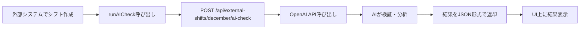

# 12月シフトAIチェック機能

外部で作成したシフトをAIで検証し、評価と改善提案を自動生成する機能です。

## 概要

1. **外部システムでシフト作成**: `DecemberShiftGeneration` コンポーネント内で12月のシフトを生成
2. **AIチェック実行**: `runAICheck(shiftData)` 関数を呼び出してAI検証を実行
3. **結果表示**: 違反、統計、改善提案が自動的に表示される

## 実装場所

### 1. フロントエンド
**ファイル**: `client/src/components/DecemberShiftGeneration.tsx`

```tsx
// 外部システムのコードをここに配置
export function DecemberShiftGeneration() {
  const [shiftData, setShiftData] = useState({ year: 2025, month: 12, shifts: [] });

  // シフト生成後にAIチェックを実行
  const handleCheckShift = async () => {
    await runAICheck(shiftData);
  };

  return (
    // UIコンポーネント
  );
}
```

### 2. バックエンド
**ファイル**: `server/routes/externalShifts.ts`
- **エンドポイント**: `POST /api/external-shifts/december/ai-check`
- **プロンプト**: `server/ai/shiftCheckPrompt.ts`

## 使い方

### ステップ1: 外部システムのコード配置

`client/src/components/DecemberShiftGeneration.tsx` の22行目以降に、外部システムのReactコードを配置します。

```tsx
export function DecemberShiftGeneration() {
  const toast = useToast();
  const [isChecking, setIsChecking] = useState(false);
  const [checkResult, setCheckResult] = useState<any>(null);

  // ===== ここに外部システムのコードを配置 =====
  const [shiftData, setShiftData] = useState({
    year: 2025,
    month: 12,
    shifts: [
      // シフトデータ
    ]
  });

  // AIチェック実行
  const handleAICheck = async () => {
    await runAICheck(shiftData);
  };

  return (
    <div className="p-6 space-y-6">
      {/* 外部システムのUI */}
      <Button onClick={handleAICheck} disabled={isChecking}>
        {isChecking ? 'チェック中...' : 'AIでチェック'}
      </Button>

      {/* 既存のAIチェック結果表示部分は自動的に表示される */}
    </div>
  );
}
```

### ステップ2: シフトデータの形式

AIチェックに渡すデータは以下の形式を推奨:

```json
{
  "year": 2025,
  "month": 12,
  "shifts": [
    {
      "employeeId": "1",
      "employeeName": "杉山美佳子",
      "date": "2025-12-01",
      "shiftType": "EARLY",
      "startTime": "06:00",
      "endTime": "15:00",
      "isHoliday": false
    },
    // ...
  ]
}
```

### ステップ3: 環境変数の設定

`.env` ファイルに OpenAI API キーを設定:

```bash
OPENAI_API_KEY=sk-xxxxx
```

## AIチェックの流れ



## 出力される結果

### 1. 違反リスト (violations)
- 職員名
- 日付
- 違反ルールID
- 重要度 (error/warning)
- 日本語説明

### 2. 統計情報 (stats)
- 職員ごとの勤務日数、夜勤回数、総労働時間
- 施設全体の夜勤配分
- フルタイム職員の配置状況

### 3. 改善提案 (suggested_changes)
- 職員名
- 日付
- 現在のシフト → 提案するシフト
- 変更理由

### 4. 総合評価 (summary_ja)
- シフト全体の評価
- 重要な問題点
- 改善方法の提案

## トラブルシューティング

### エラー: "OPENAI_API_KEY is not configured"
→ 環境変数が設定されていません。`.env` ファイルにAPIキーを追加してください。

### エラー: "Failed to parse AI response"
→ AIのレスポンスがJSON形式でない可能性があります。ログを確認してください。

### チェックに時間がかかる
→ シフトデータが大きい場合、30秒〜1分程度かかることがあります。

## カスタマイズ

### プロンプトの変更
`server/ai/shiftCheckPrompt.ts` のプロンプトを編集することで、チェックルールをカスタマイズできます。

### UIのカスタマイズ
`client/src/components/DecemberShiftGeneration.tsx` の結果表示部分をカスタマイズできます。

## APIリファレンス

### POST /api/external-shifts/december/ai-check

**Request Body**:
```json
{
  "year": 2025,
  "month": 12,
  "shifts": [...]
}
```

**Response**:
```json
{
  "success": true,
  "result": {
    "violations": [...],
    "stats": {...},
    "suggested_changes": [...],
    "summary_ja": "..."
  },
  "usage": {
    "prompt_tokens": 1234,
    "completion_tokens": 5678,
    "total_tokens": 6912
  }
}
```
